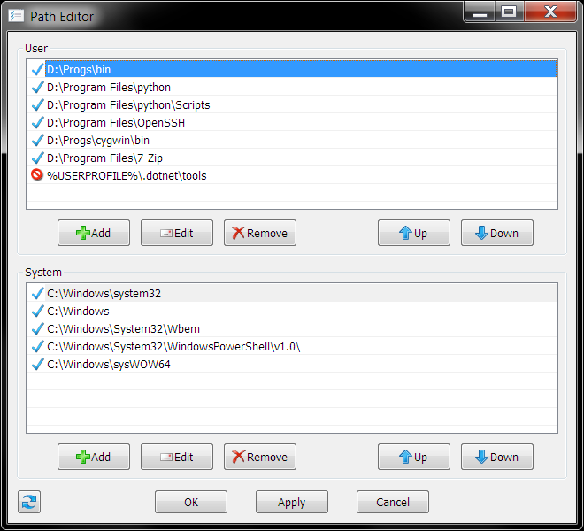

patheditor
==========
Edit PATH environment on Windows conveniently

The default environment editor is not great at editing PATH if there are lot of entries and many of them are similar looking.
* Implemented using Win32, **Does not depend on MFC or .NET**
* Missing folders are highlighted with different icon.
* To edit System PATH, offers to be launched with elevated admin privilege, similar to "Run as Administrator"
* Double clicking any path entry attempts to open in Windows Explorer.



## Extended version features
* Window resizing
* Apply/Reload
* Insert after selected (Shift+Add)
* Clipboard operations
* Manual in-place edit
* Modern pick folder dialog
* Hotkeys:
  | Hotkeys            | Action            |
  |--------------------|-------------------|
  |       (Ctrl+Enter) | Commit and exit   |
  |      (Shift+Enter) | Commit            |
  |               (F5) | Reload            |
  |         (Ctrl+Tab) | Switch b/w Lists  |
  |                    |                   |
  |  (Ctrl+C Ctrl+Ins) | Copy item         |
  | (Ctrl+X Shift+Del) | Cut item          |
  | (Ctrl+V Shift+Ins) | Paste item        |
  |               (F2) | Manual edit       |
  |              (Ins) | Add item (Dialog) |
  |              (Del) | Remove item       |
  |          (Ctrl+Up) | Move item up      |
  |         (Ctr+Down) | Move item down    |


## Building from source
### CMake build
Build tools required:  
 * Clang / MSVC C++ compiler (GCC is not supported)
 * Windows SDK
 * MSVC libs
 * CMake
 * Ninja

to configure open command prompt in the mak directory and run:
```
cmake . -B build -G Ninja -DCMAKE_BUILD_TYPE=Release
```
if configure succedes, to start the build run:
```
cmake --build build && cmake --install build --strip
```
cmake --install will put the resulting executable into the mak\bin directory

<br>

### MS Build tools
Build tools required:  
 * MS C++ Build Tools (or complete MS Visual Studio)
 * Windows SDK
 * MSVC libs

Open Native Tools Command Prompt in the mak directory and run (for x86_64 CPU)
```
msbuild /p:Configuration=Release /p:Platform=x64 PathEditor.sln
```
The resulting executable will be in mak\bin\Release\x64 directory
